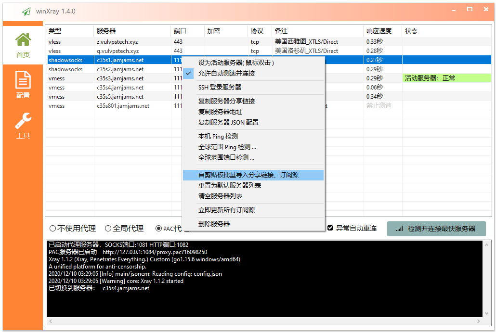
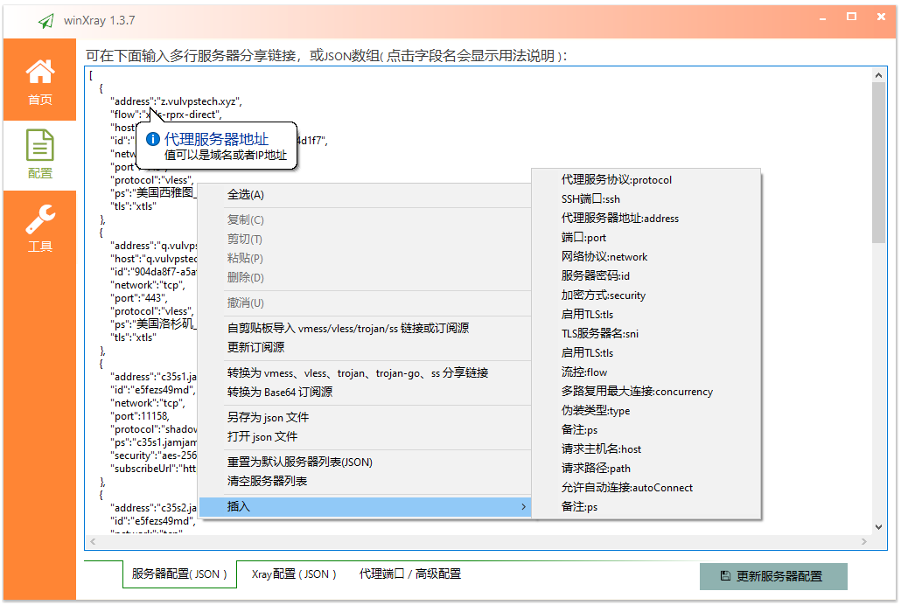
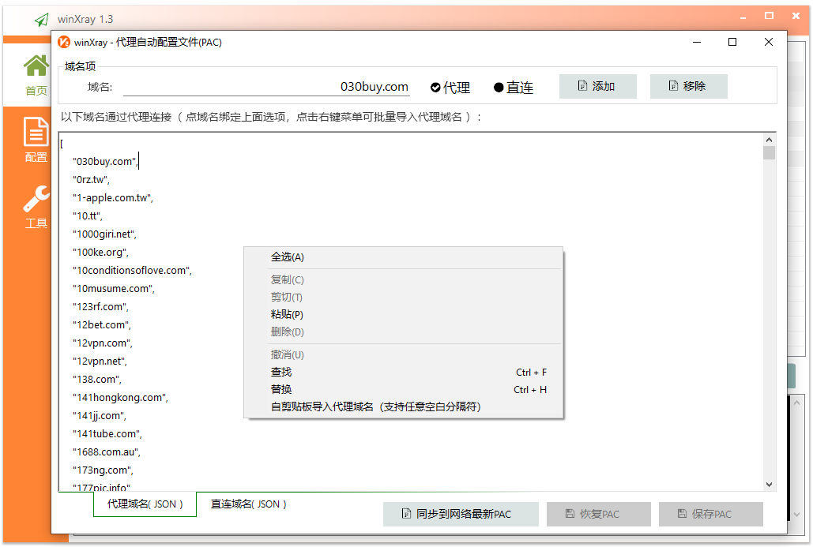
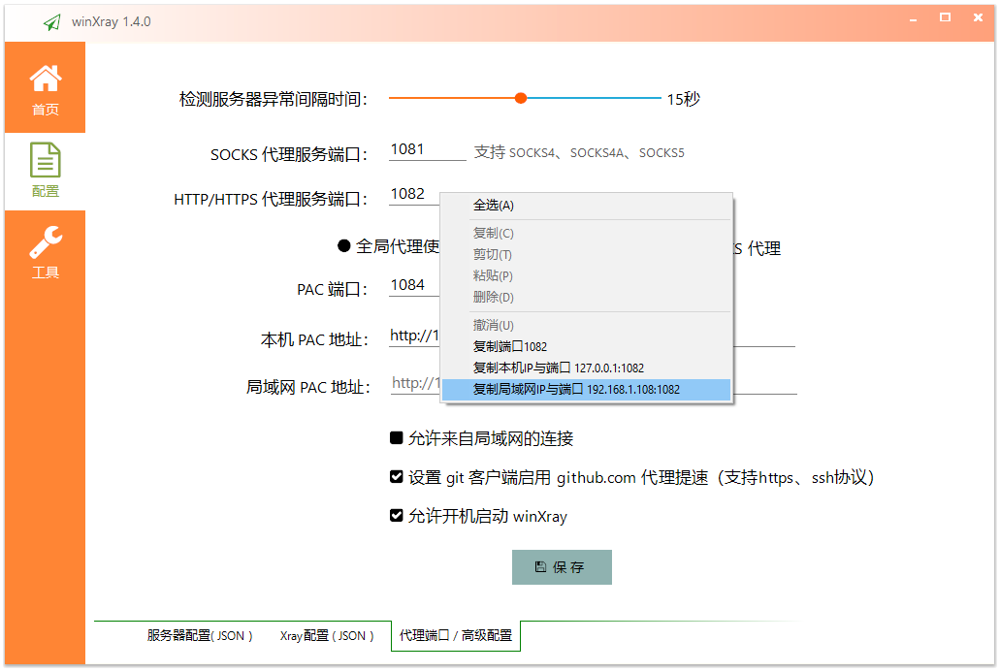
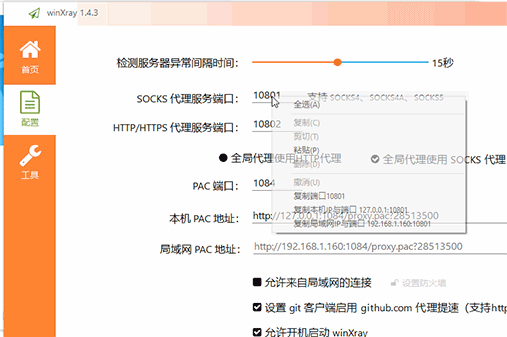

# winXray 
本软件源码已贡献到公共领域并放弃版权，源码可使用 [aardio（开发环境仅6.5MB）](http://www.aardio.com) 编译生成单文件绿色EXE( 不需要.Net等任何外部运行库 ），**[点这里下载](https://raw.githubusercontent.com/winXray/winXray/master/release/winXray.7z)** （ [64位版本](https://raw.githubusercontent.com/winXray/winXray/master/release/winXray.7z) / [32位版本](https://raw.githubusercontent.com/winXray/winXray/master/release/winXray32.7z) ），解压即可直接使用( 仅  **[5.0MB](https://raw.githubusercontent.com/winXray/winXray/master/release/winXray.7z)** - 已自带 Xray-core）。

winXray[:loud_sound:](http://dict.youdao.com/dictvoice?audio=winxray&type=2) 是一个简洁稳定的 [Xray/V2Ray(vmess/vless/xtls)、Shadowsocks、Trojan](https://github.com/XTLS/Xray-core) 通用客户端（Windows系统），可自动检测并连接访问速度最快的代理服务器。服务器连接异常时可以自动更换代理服务器 - 再也不用担心服务器抽风了。winXray 也提供一键安装 XRay(V2Ray、Shadowsocks、Trojan) 服务器工具。   

之前我用过很多代理客户端，经常用一会就挂掉了，有些测试很久才找到下一个可用的服务器，有时怎么切换都不行，一定要把整个软件退出重启才能恢复。而且在WIN10上都有相同的BUG:PAC代理用一段时间就会卡死( winXray已经通过自行实现PAC服务器解决了这个问题 )，其实这些软件里提供的很多功能我并不需要，我只想愉快地用下 google 找点技术资料提升工作效率。但是在网上找了很久都没找到适合的软件，于是决定自己动手写一个，还好用 aardio 写软件的速度很快 - 大概用了几个小时就完成了 winXray 的主要代码，改进了几个版本以后就很稳定了，**我自己用了 winXray  几个月再也没有遇到 google 抽风访问不了的问题**。    

这里说明一下:一些网友对测速功能存在误解，有一些软件提供的测速其实没有什么实用价值，例如Ping通了TCP访问不了，TCP通了但浏览器被阻断，或者下载测速需要连接代理服务器以后长时间测试才能得到下载速度 - 这显然也没有什么实用价值。如果这些软件能用我就不会自己花力气来写 winXray了。**根据我长时间的实测，我使用一堆的服务器，大多时候 winXray 都能最快的找到其中速度最快、且能正常使用的CN2 GIA线路**（ 有一些人认为响应速度与网络速度无关这基本是胡扯，你可以试试国内国外服务器响应速度会差多少 ）。

要考虑到网络速度与服务器响应速度本来就是波动的，**winXray 需要在连接代理服务器以前在零点几秒以内快速地在上百个代理服务器中找出最快的服务器**，尤其是在国外服务器大规模抽风不稳定的时期帮助我们节省选择服务器的时间。如果你牛逼到有一堆流畅看4K的代理服务器、并且从来没有遇到过抽风和访问异常，那你真是太幸福了恭喜你，但很可惜我们这里没有这种幸福的网络环境。虽然大家很喜欢用4K视频来做测试，但是我们大多时候使用  winXray 这种软件不是为了一天到晚看 4K 视频，而是为了找点技术资料或者工作需要，例如上 github 拉个源码，有个几MB的下载速度我们做梦都能笑醒了。如果你跟我一样有这样的需求，那 winXray 就是为你准备的。

另外有某些代理软件不支持PAC，就把PAC贬低得一无是处，连跳过局域网这种理由都能写出来，这种我个人觉得基本没有解释的意义。很多时候你判断一个功能好不好用，要实际去使用 - 苹果的味道要自己试过才知道，而不是看了几篇文章想当然的跟着喷。不要想当然的认为复杂臃肿的软件就一定更好用，**代理软件本身就应当保持简洁，不应当搞成什么插件平台、做得比操作系统还复杂。大多时候，PAC对于我们来说 - 简单、粗暴、够用！！！**

winXray支持批量导入 vless、vmess、ss、trojan、trojan-go …… 等格式的分享链接，  
也可以导入通用订阅链接，以及 base 64、json …… 等不同格式的服务器配置。

**小技巧: JSON里点击任意字段都会显示该字段的用法说明。**

可选在 ["/xray-core/winXray-default-servers.json"](./xray-core/winXray-default-servers.json) 文件中添加默认服务器配置（生成EXE后默认配置自动嵌入到EXE文件，可选删除该文件,也可以继续使用该文件覆盖EXE自带的默认服务器列表）。

**小技巧: PAC编辑器里点击任意域名都会自动关联到单选框，可以直接切换代理或直连。**

软件首次运行时会在当前目录查找 "./xray-core/xray.exe"   
发行文件仅需要 "./winXray.exe"，可选带上 "./xray-core/" 目录（ 如果没有找到会自动到v2ray官网下载，不过没有代理服务器下载有时候非常慢 )。

